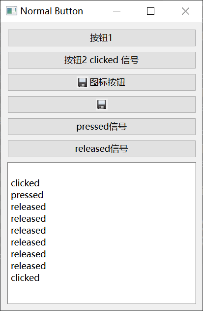
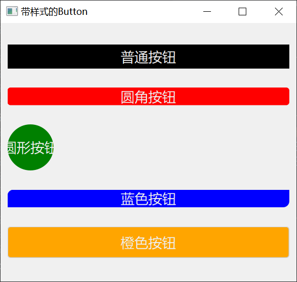

## QPushButton

### PushButton 属性
- `autoDefault` 按钮是否为自动默认 button
- `default` 按钮是否为默认按钮
- `flat` 按钮边框是否凸起

### PushButton 信号
- `clicked` 点击信号
- `pressed` 按下信号
- `release` 释放信号
- `checked` 选中信号

### 普通样式
运行 [normal_button.py](normal_button.py) 查看普通按钮效果

### 带样式
运行 [style_button.py](style_button.py) 查看运行效果

